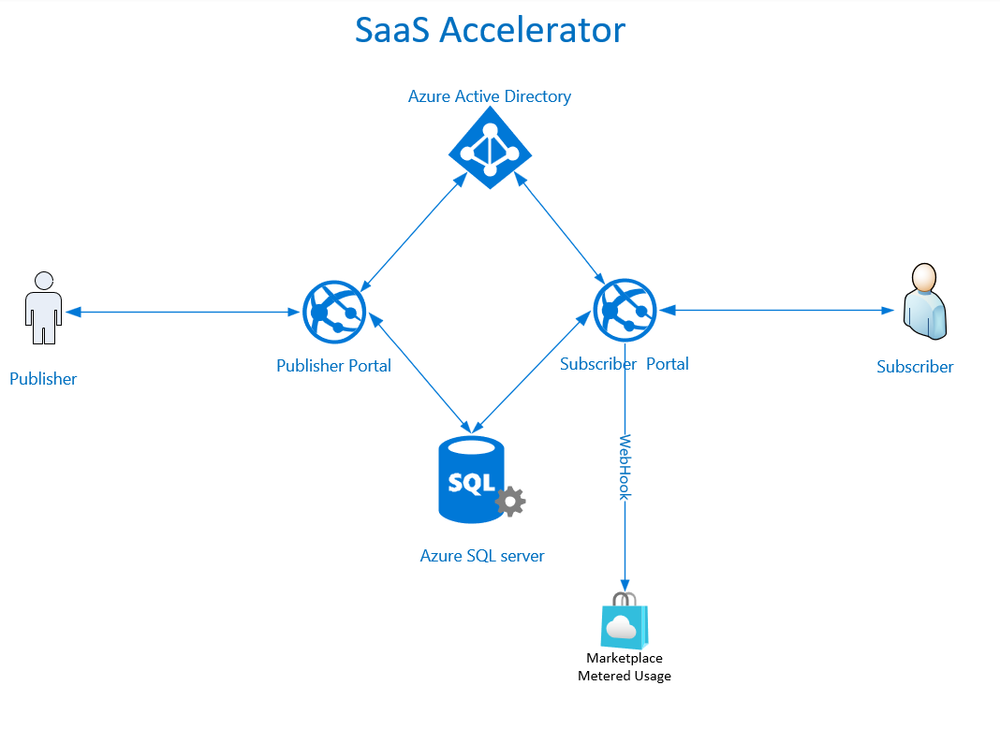
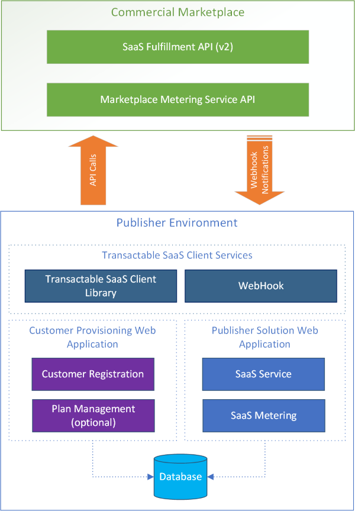

# Microsoft Commercial Marketplace - Community Code for SaaS Applications

<!-- no toc -->
- [Introduction](#introduction)
- [Intended Use](#intended-use)
- [Installation](#installation)
- [Commercial Marketplace Documentation](#commercial-marketplace-documentation)
- [SaaS Accelerator Overview](#saas-accelerator-overview)
- [Projects](#projects)
- [Technology and Versions](#technology-and-versions)
- [Security](#security)
- [Prerequisites](#prerequisites)
- [Contributing](#contributing)
- [Developers](#developers)
- [FAQs](#faqs)
- [License](#license)

---

> 📝 Please [leave us your ideas and feedback](https://forms.office.com/r/M4dXD5EqhL) on the SaaS Accelerator in this brief, anonymous survey.

---

## Introduction

The SaaS Accelerator is a production-ready solution designed to make it easier for Microsoft partners to sell their SaaS solutions via Microsoft Commercial Marketplace. Microsoft partners can use SaaS Accelerator to simplify the process of bringing their SaaS solutions to the Marketplace. It is a ready-to-use, community-supported solution providing the following capabilities:

🚀 Quick & Easy Deployment: Go live in under 15 minutes with our low-code, production-ready solution.

🔧 Turnkey Solution: Meets all technical prerequisites for your SaaS offers.

💼 Subscriptions Simplified: A streamlined interface to optimize your subscription workflow.

💲 Flexible Billing: Advanced capabilities for custom billing and pricing models.

🛠️ Stay in Control: A dedicated adminstrative portal for managing all your customer subscriptions.

Transform your SaaS game. Leverage SaaS Accelerator now!

## Description

The project is implemented in .NET and uses the commercial marketplace billing system, including the [SaaS Fulfillment API (v2)](https://docs.microsoft.com/en-us/azure/marketplace/partner-center-portal/pc-saas-fulfillment-api-v2) and [Marketplace Metering Service API](https://docs.microsoft.com/en-us/azure/marketplace/partner-center-portal/marketplace-metering-service-apis). The SaaS Accelerator models how a typical SaaS platform interacts with the marketplace APIs to provision subscriptions for customers, enable logging, and manage commercial marketplace subscriptions. The SaaS Accelerator may be installed as-is or may be customized to support your requirements. 

## Stay current with the latest updates!

The SaaS Accelerator project team releases regularly releases new versions. Please see the [release notes page](https://github.com/Azure/Commercial-Marketplace-SaaS-Accelerator/releases) for updates. We recommend keeping up to date with latest releases to stay current on security patches, bug fixes, and new features.

To update your SaaS Accelerator installation, use the **Update script** [documented here](./docs/Installation-Instructions.md#update-to-a-newer-version-of-the-saas-accelerator).

## Intended Use

This code is a reference implementation of required components of a commercial marketplace SaaS offer and complements the existing commercial marketplace documentation.

This project accelerates the SaaS offer onboarding experience for those building SaaS solutions for the Microsoft commercial marketplace. Whether installed and used as-is or customized for your particular requirements, this reference implementation provides all main components required by a commercial marketplace SaaS offer.

> NOTE: Support for this project is community-based and contributions are welcome. Details on contributing can be found [below.](https://github.com/Azure/Commercial-Marketplace-SaaS-Accelerator#contributing). This is not an officially supported Microsoft product.

## Installation

**[Installation instructions are here](./docs/Installation-Instructions.md)**, as well as documents detailing architecture and scaled installation considerations are also available. Following these instructions will typically have the SaaS Accelerator installed in 20 minutes or less.

**[Advanced Installation instructions are here](./docs/Advanced-Instructions.md)**. These are detailed instructions to address different deployment scenarios such as how-to run it locally or deploy it from Visual Studio.

**Video instructions** Additionally, there is a quick video on the installation process. [Installing the SaaS Accelerator with the Azure portal cloud shell](https://go.microsoft.com/fwlink/?linkid=2196326) available through [Mastering the Marketplace](https://microsoft.github.io/Mastering-the-Marketplace).

**[Upgrade to newer version](./docs/Installation-Instructions.md#update-to-a-newer-version-of-the-saas-accelerator)** Follow these instructions to move your 6.x release to the current version.

### Additional technical documents

<!-- 1. [Advanced installation](docs/Advanced-Instructions.md) - This document details more manual installation instructions and how to set up a local development environment.  -->
1. [Enterprise reference architectures](docs/Enterprise-Reference-Architecture.md)
2. [Single region architectures](./docs/Enterprise-Reference-Architecture-Single-region.md)
3. [Multi-region architectures](./docs/Enterprise-Reference-Architecture-multi-region-saas-rg.md)
4. [Advanced installation checklist](./docs/Enterprise-Reference-Architecture-Checklist.md)

### Monitoring

The following documents provide how-tos for setting up Azure Monitoring and Alerting for the resources deployed by the SaaS Accelerator:

- [Web App Monitoring and Alerting instructions](./docs/WebApp-Monitoring.md)
- [SQL Server Monitoring and Alerting instructions](./docs/SQL-Server-Monitoring.md)
- [App Registration Credentials Monitoring and Alerting instructions](./docs/App-Reg-Monitoring.md)

## Commercial Marketplace Documentation

Before using this project, please review the commercial marketplace documentation resources below to understand the important concepts, account setup, and offer configuration requirements for publishing SaaS SaaS application offers.

- [Mastering the Marketplace - SaaS Offers](https://aka.ms/MasteringTheMarketplace/saas-accelerator). Zero-to-Hero Training on Azure Marketplace SaaS offers using the Accelerator.
- [Commercial marketplace documentation](https://docs.microsoft.com/azure/marketplace/). Getting started and top articles
- [SaaS applications in the commercial marketplace](https://docs.microsoft.com/azure/marketplace/partner-center-portal/create-new-saas-offer). Overview of the SaaS application business policies, plus step-by step offer creation and configuration requirements.
- [SaaS fulfillment API (v2)](https://docs.microsoft.com/azure/marketplace/partner-center-portal/pc-saas-fulfillment-api-v2). API details for SaaS application subscription creation and management.
- [Marketplace metering service API](https://docs.microsoft.com/azure/marketplace/partner-center-portal/marketplace-metering-service-apis). API details for the Marketplace Metering Service which, when used in conjunction with the SaaS Fulfillment API, enables event-based billing.
- [SaaS fulfillment API FAQ](https://docs.microsoft.com/azure/marketplace/partner-center-portal/saas-fulfillment-apis-faq). Frequently asked questions about the SaaS Fulfillment APIs.

## SaaS Accelerator Overview

## Projects

The source `/src` directory contains the following Visual Studio projects.

| Project | Description | Directory Name |
| --- | --- | --- |
| [**Customer portal - Sample web application**](./src/CustomerSite) | Demonstrates how to register, provision, and activate the marketplace subscription. Implemented using ASP.Net Core 6.0, the sample web application uses the Services client library and data access library to invoke and persist API interactions and provides an example user interface to demonstrate how a customer would manage their subscriptions and plans. |CustomerSite|
| [**Publisher portal - Sample web application**](./src/AdminSite) | Demonstrates how to generate usage events used in metered billing transactions, and how to emit these events to the Marketplace Metering Service API. |AdminSite|
| [**Client data access library**](./src/DataAccess) | Demonstrates how to persist plans, marketplace subscriptions, and related transaction attributes when using the SaaS Fulfillment API (v2) and Marketplace Metering Service API. |DataAccess |
| [**Services client library**](./src/Services) | Contains the services used by the Customer and Publisher portals, including the POCO classes to orchestrate calls to the marketplace APIs on [client library](https://github.com/microsoft/commercial-marketplace-client-dotnet) / database.|Services |
| [**Unit tests project**](./src/Services.Test) | Helps validate and test the codebase. | ServicesTest |

The sample code in this repository runs in the publisher's environment as illustrated below. The metering SDK (.NET class library) and a sample web application to report usage events for subscriptions against those plans that support metering (have the dimensions defined and enabled) and correlate to SaaS Metering and SaaS Service blocks in the below image, respectively.

## Technology and Versions

This project has been developed using the following technologies and versions:

- [.NET 6](https://dotnet.microsoft.com/en-us/download/dotnet/6.0)
- [ASP.NET Core Runtime 6](https://dotnet.microsoft.com/en-us/download/dotnet/6.0)
- [Entity Framework](https://docs.microsoft.com/ef/)

## Security

The accelerator code has been scanned for vulnerabilities and use secure configurations. Versions have been reviewed to ensure compatibility with the latest security guidelines. To enhance the best practices please see [Security best practices](./docs/Security-Best-Practices.md).

## Prerequisites

Ensure the following prerequisites are met before getting started:

- You must have an active Azure subscription for development and testing purposes. Create an Azure subscription [here](https://azure.microsoft.com/free/).
- You must have a Partner Center account enabled for use with the commercial marketplace. Create an account [here](https://docs.microsoft.com/azure/marketplace/partner-center-portal/create-account).
- We recommend using an Integrated Development Environment (IDE):  [Visual Studio Code](https://code.visualstudio.com/),  [Visual Studio 2019 / 2022](https://visualstudio.microsoft.com/thank-you-downloading-visual-studio/?sku=Community&rel=16#), etc...
- The SaaS Accelerator has been implemented using [.NET 6](https://dotnet.microsoft.com/en-us/download/dotnet/6.0)
- For data persistence we are using [Azure SQL Database](https://azure.microsoft.com/services/sql-database/) and [Entity Framework](https://docs.microsoft.com/ef/). However, feel free to use any data repository you are comfortable with.  

## Contributing

This project welcomes contributions and suggestions.  Most contributions require you to agree to a
Contributor License Agreement (CLA) declaring that you have the right to, and actually do, grant us
the rights to use your contribution. For details, visit <https://cla.opensource.microsoft.com.>

When you submit a pull request, a CLA bot will automatically determine whether you need to provide
a CLA and decorate the PR appropriately (e.g., status check, comment). Simply follow the instructions
provided by the bot. You will only need to do this once across all repos using our CLA.

This project has adopted the [Microsoft Open Source Code of Conduct](https://opensource.microsoft.com/codeofconduct/).
For more information see the [Code of Conduct FAQ](https://opensource.microsoft.com/codeofconduct/faq/) or
contact [opencode@microsoft.com](mailto:opencode@microsoft.com) with any additional questions or comments.

## Developers

Code contributed should follow the C# specifications and best practices as documented [here](https://docs.microsoft.com/en-us/dotnet/csharp/programming-guide/inside-a-program/coding-conventions).

## FAQs

There is a list of the Frequent Asked Questions [here](./docs/FAQs.md).

## License

This project is released under the [MIT License](LICENSE).
